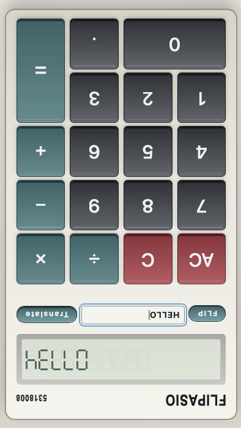

# flipasio

A web-based retro calculator experience inspired by classic 1980s Casio pocket calculators.

## Vision
Create a pixel-faithful calculator UI with a segmented LCD display and a playful flip mode that turns numbers into upside-down words.

## Preview
Flipped calculator with `HELLO` translated to `0.7734`.

## Notes
- Web app source lives in `web/`.
- Product requirements live in `SPEC.md` (ignored by Git).
- Execution checklist lives in `TASKS.md` (ignored by Git).
